# Docker & Kubernetes

## [Install Docker Desktop on Ubuntu](https://docs.docker.com/desktop/install/ubuntu/)

    # 1. Set up Docker's apt repository.
    # Add Docker's official GPG key:
    sudo apt-get update
    sudo apt-get install ca-certificates curl
    sudo install -m 0755 -d /etc/apt/keyrings
    sudo curl -fsSL https://download.docker.com/linux/ubuntu/gpg -o /etc/apt/keyrings/docker.asc
    sudo chmod a+r /etc/apt/keyrings/docker.asc

    # Add the repository to Apt sources:
    echo \
        "deb [arch=$(dpkg --print-architecture) signed-by=/etc/apt/keyrings/docker.asc] https://download.docker.com/linux/ubuntu \
        $(. /etc/os-release && echo "$VERSION_CODENAME") stable" | \
        sudo tee /etc/apt/sources.list.d/docker.list > /dev/null
    sudo apt-get update
    # 2. Install the Docker packages.
    sudo apt-get install docker-ce docker-ce-cli containerd.io docker-buildx-plugin docker-compose-plugin
    # 3. Verify that the Docker Engine installation is successful by running the hello-world image.
    sudo docker run hello-world

#### Download Doker Desktop    
    # Download the DEB package
    sudo apt-get remove docker docker-engine docker.io
    sudo apt-get update
    sudo apt-get install ./docker-desktop-<arch>.deb
    systemctl --user start docker-desktop
    # Check for docker version
    docker compose version
    docker --version
    docker version
    sudo systemctl status docker
    # To enable Docker Desktop to start on sign in
    systemctl --user enable docker-desktop
    # testing docker by running hello-world container
    sudo docker run hello-world
    # To stop Docker Desktop
    systemctl --user stop docker-desktop
    # To upgrade Docker Desktop and run
    sudo apt-get install ./docker-desktop-<arch>.deb

    # Signing in with Docker Desktop for Linux
    # You can initialize pass by using a gpg key. To generate a gpg key, run:
    gpg --generate-key
    To initialize pass, run the following command using the public key generated from the previous command:
    pass init <your_generated_gpg-id_public_key>
    # Once you initialize pass, you can sign in and pull your private images. 
    docker pull <username>/privateimage

## [Linux post-installation steps for Docker Engine](https://docs.docker.com/engine/install/linux-postinstall/)

### To create the docker group and add your user:
1. Create the docker group.

        sudo groupadd docker

2. Add your user to the docker group.

        sudo usermod -aG docker $USER

3. Log out and log back in so that your group membership is re-evaluated.
- If you're running Linux in a virtual machine, it may be necessary to restart the virtual machine for changes to take effect.
- You can also run the following command to activate the changes to groups:
        
        newgrp docker

4. Verify that you can run docker commands without sudo.

        docker run hello-world

### Configure Docker to start on boot with systemd

    sudo systemctl enable docker.service
    sudo systemctl enable containerd.service

#### To stop this behavior, use disable instead.

    sudo systemctl disable docker.service
    sudo systemctl disable containerd.service

## M1_Starting_Setup
### Creating Docker Image
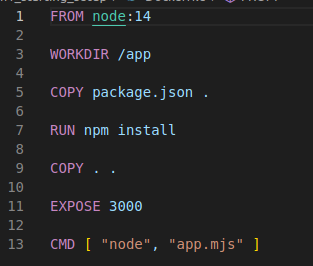

#### Build the docker image with the following command
    docker build .

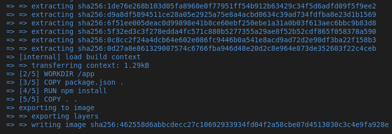

#### Run a container using the image ID

    docker run -p 3000:3000 462558d6abbcdecc27c10692933934fd04f2a58cbe07d4513030c3c4e9fa928e

#### A running web server on localhost:3000

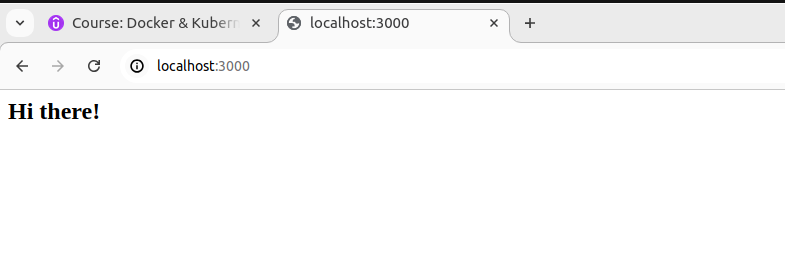

#### To stop the current docker container on new terminal run:

    docker ps

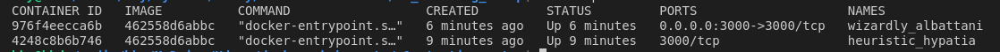

    # docker stop <NAME>
    docker stop wizardly_albattani

## M2_Docker_images_and_containers

#### Using and Running External(Pre-Built) Images

    docker run node

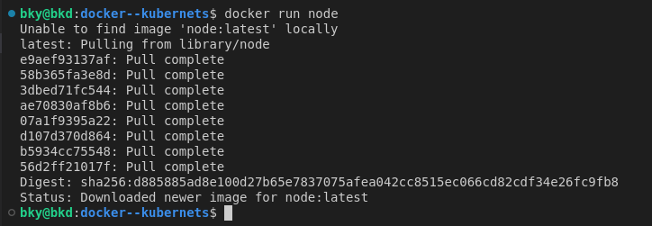

#### List conatiners 

    docker ps -a

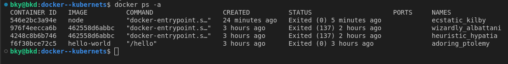

### Docker Container 2

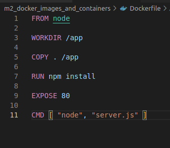

#### Create an Image using Dockerfile 

    docker build .

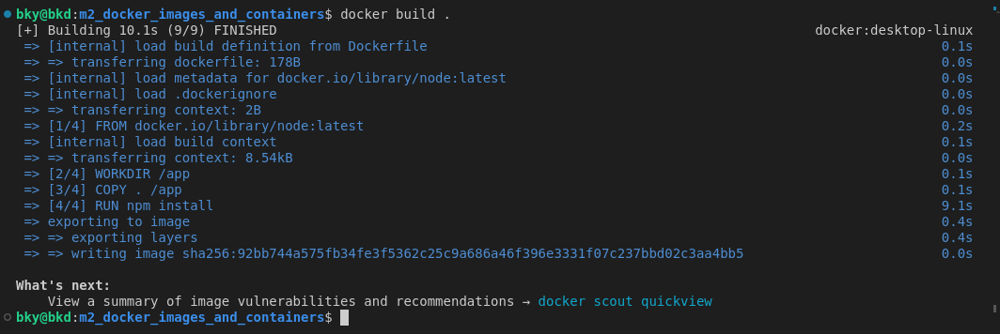

#### Run a container using this Docker Image

    docker run -p 3000:80 <image id>
    # To stop open new terminal and run
    docker ps
    docker stop <Name>

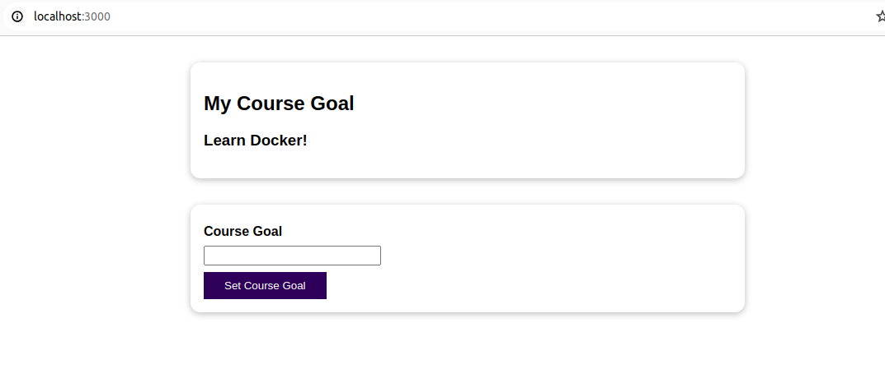

### Image Layers are only build again when the previous layer has been modified 

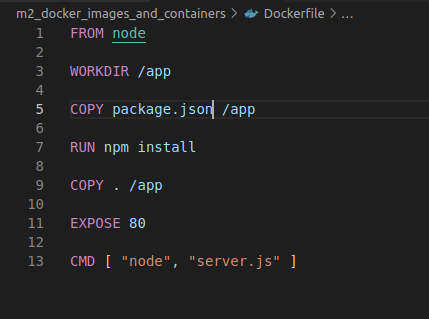

#### For any change on the source code run:

    docker build .
    docker run <image-id>
#### The "--help" command list different command options

    docker ps --help

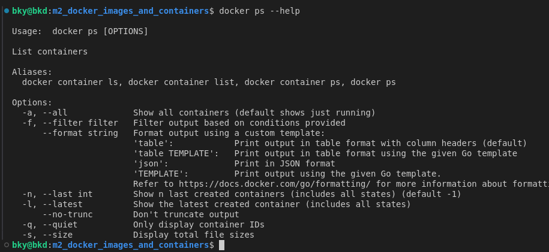

#### Stoping and Restarting a container

    # To start a stoped container
    docker ps -a
    docker start <conainer name>
    docker stop <conainer name>

#### Attached (attach) and Detached Containers (-d)

    docker run -p 8000:80 -d <image id>
    # To attach again run:
    docker attach <container name>
    # To fetch the logs that were printed by a container run:
    docker logs <container-name>
    # To follow listening on that container
    docker logs -f <container-name>

#### M2.1_Entering_Interactive_Mode

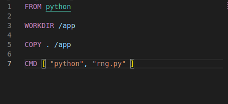

    # Building a docker image
    docker build
    # Running a container using a docker image using interative mode
    docker run -it <image id>
    # To start a container again
    docker start -a -i <image id>

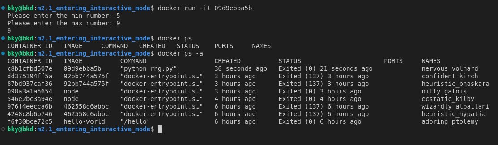

#### Deleting Images and Containers

    # Check for running containers
    docker ps
    docker stop <container name>
    # To delete a container 
    docker rm <container name1> <container name2> ...
    # To remove all containers at once
    docker container prune

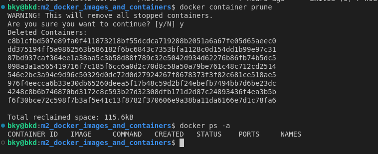

    # To list images
    docker images

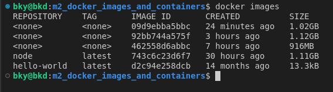

    # To remove an image
    # remove the container related to the image
    docker rmi <image id>
    # To remove all images
    docker rmi <image id-1> <image id-2> ...
    # OR
    docker image prune

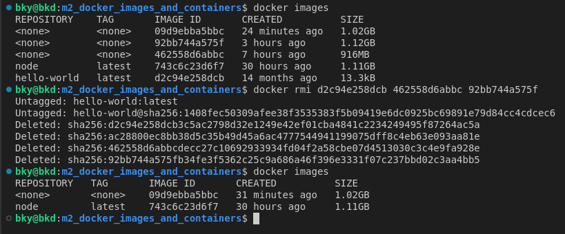

#### Remmoving stoped container automatically (--rm)

    docker run -p 3000:80 -d --rm <image id>

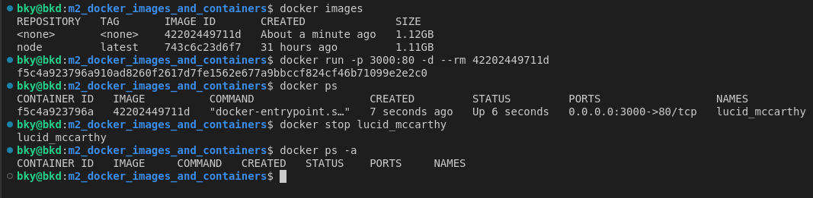

#### Inspect an Image

    docker image inspect <image id>

#### Copying files Into and From a container (cp)

    docker cp source/. <container-name>:/test
    docker cp <container-name>:/test/test.txt source 

#### Naming and Tagging Containers 

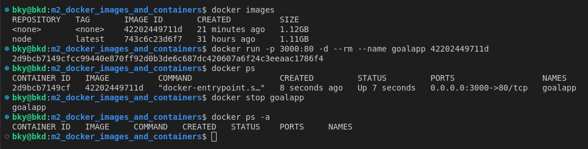

#### Naming and Tagging Images

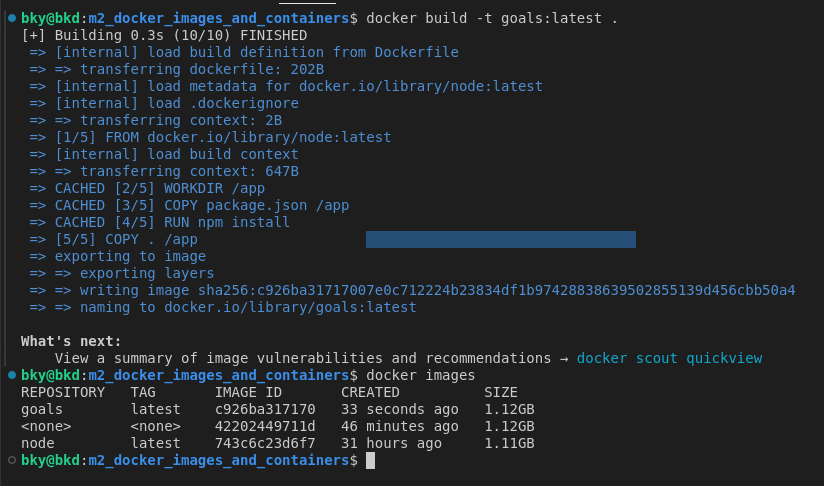

    # To remove all images inluding Tagged images:
    docker image prune -a

#### Sharing images via Docker Hub 

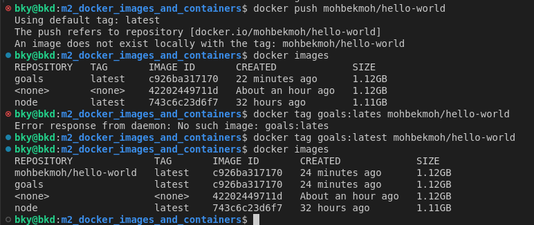

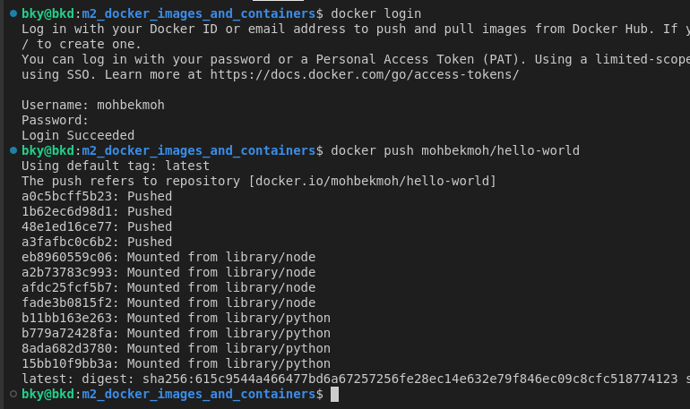

#### Pulling and using Shared images

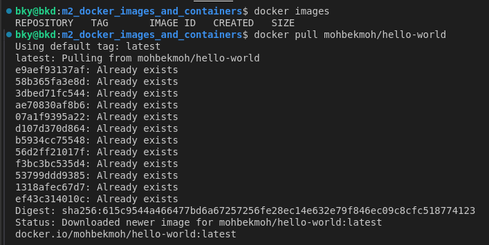

## M3_Managing_data_and_working_with_volumes

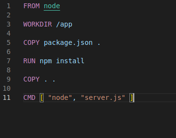

#### Create an image

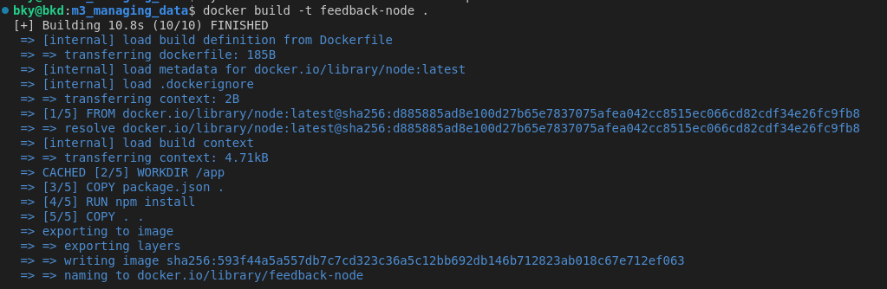

#### Container 

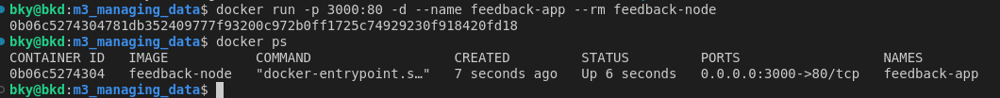

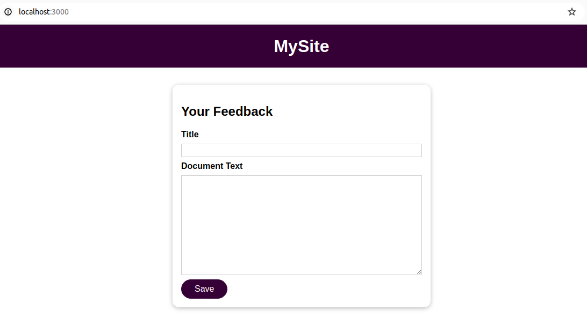

### Volume

#### Create a docker image with volume

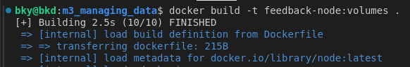

#### Create a docker container with volume

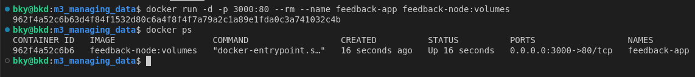

#### Updating the server.js file for volumes to work

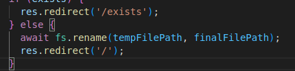

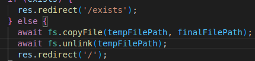

#### Anonymous volumes

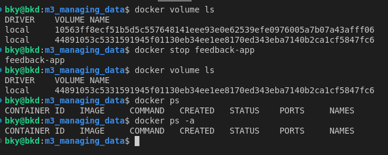

#### Named volumes dockerfile

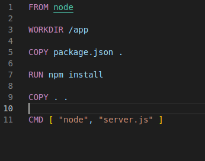

#### Create a docker container with a named volume

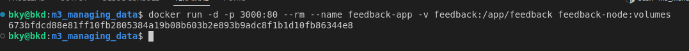

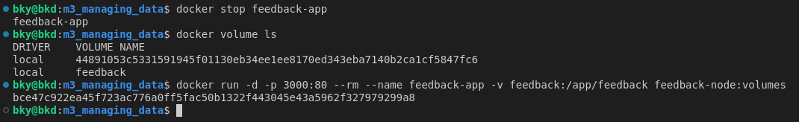

#### Remove anonymous volume

    docker volume rm <volume name>
    docker volume prune

#### Bind Mounts

    docker run -d -p 3000:80 --rm --name feedback-app -v feedback:/app/feedback -v "$(pwd):/app:ro" -v /app/node_modules feedback-node:volumes

#### Before modifying host machine file

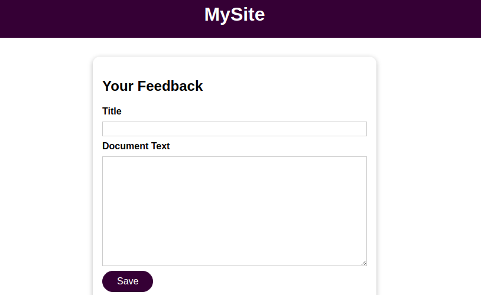

#### After modifying host machine file

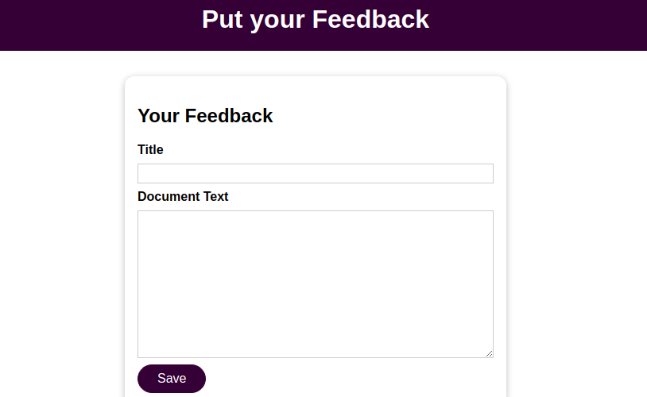

### Using Nodemon in a container 
#### Add the "scripts" and "devDependencies" in package.json

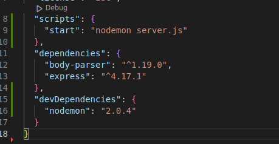

#### Update Docker file

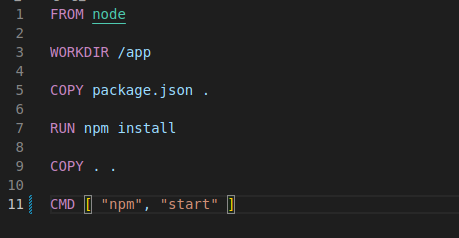

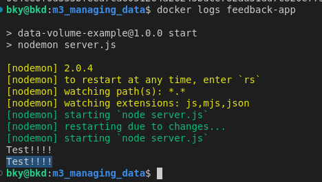

## M4_Containers_and_Networking

#### Creating_a_Container_and_Communicating_to_Web(WW)

#### Running mongodb on host machine

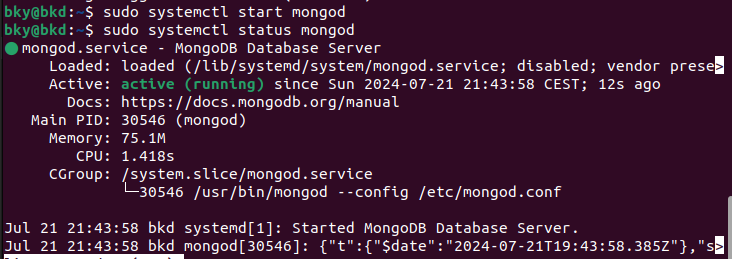

#### Connect mongodb (host.docker.internal)

#### Create docker image

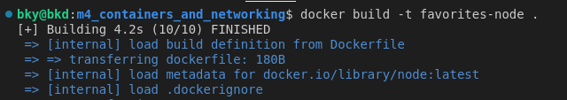

#### Create docker container

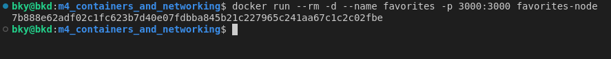

#### Make container to host (mongodb) request 

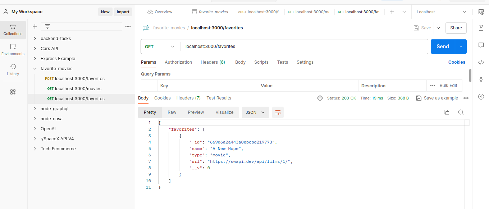

#### Container to container communication 
#### Create mongodb container 

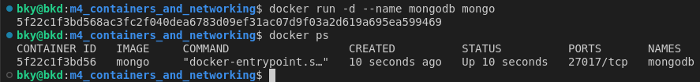

#### Set mongodb container IPAddress to node application

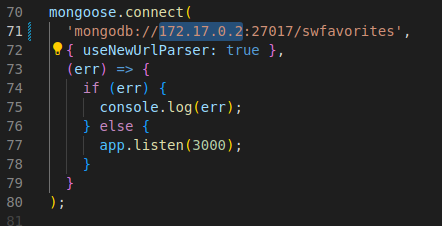

#### Running app.js container 

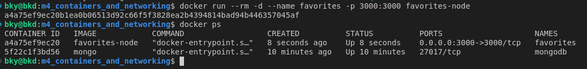

#### Container to container communication

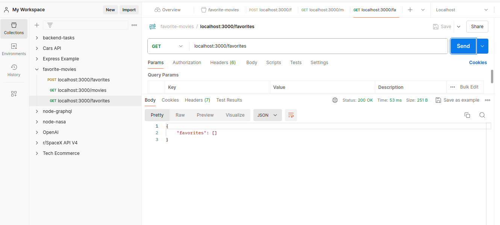

#### Creating Container Network

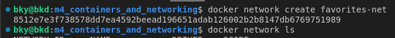

#### Update app.js  mongoose connectiom with new mongodb container name (mongodb)

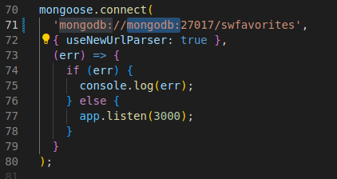

#### Build docker image 

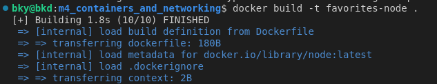

#### Run docker container using this image

