# Docker & Kubernetes

## [Install Docker Desktop on Ubuntu](https://docs.docker.com/desktop/install/ubuntu/)

    # 1. Set up Docker's apt repository.
    # Add Docker's official GPG key:
    sudo apt-get update
    sudo apt-get install ca-certificates curl
    sudo install -m 0755 -d /etc/apt/keyrings
    sudo curl -fsSL https://download.docker.com/linux/ubuntu/gpg -o /etc/apt/keyrings/docker.asc
    sudo chmod a+r /etc/apt/keyrings/docker.asc

    # Add the repository to Apt sources:
    echo \
        "deb [arch=$(dpkg --print-architecture) signed-by=/etc/apt/keyrings/docker.asc] https://download.docker.com/linux/ubuntu \
        $(. /etc/os-release && echo "$VERSION_CODENAME") stable" | \
        sudo tee /etc/apt/sources.list.d/docker.list > /dev/null
    sudo apt-get update
    # 2. Install the Docker packages.
    sudo apt-get install docker-ce docker-ce-cli containerd.io docker-buildx-plugin docker-compose-plugin
    # 3. Verify that the Docker Engine installation is successful by running the hello-world image.
    sudo docker run hello-world

#### Download Doker Desktop    
    # Download the DEB package
    sudo apt-get remove docker docker-engine docker.io
    sudo apt-get update
    sudo apt-get install ./docker-desktop-<arch>.deb
    systemctl --user start docker-desktop
    # Check for docker version
    docker compose version
    docker --version
    docker version
    sudo systemctl status docker
    # To enable Docker Desktop to start on sign in
    systemctl --user enable docker-desktop
    # testing docker by running hello-world container
    sudo docker run hello-world
    # To stop Docker Desktop
    systemctl --user stop docker-desktop
    # To upgrade Docker Desktop and run
    sudo apt-get install ./docker-desktop-<arch>.deb

    # Signing in with Docker Desktop for Linux
    # You can initialize pass by using a gpg key. To generate a gpg key, run:
    gpg --generate-key
    To initialize pass, run the following command using the public key generated from the previous command:
    pass init <your_generated_gpg-id_public_key>
    # Once you initialize pass, you can sign in and pull your private images. 
    docker pull <username>/privateimage

## [Linux post-installation steps for Docker Engine](https://docs.docker.com/engine/install/linux-postinstall/)

### To create the docker group and add your user:
1. Create the docker group.

        sudo groupadd docker

2. Add your user to the docker group.

        sudo usermod -aG docker $USER

3. Log out and log back in so that your group membership is re-evaluated.
- If you're running Linux in a virtual machine, it may be necessary to restart the virtual machine for changes to take effect.
- You can also run the following command to activate the changes to groups:
        
        newgrp docker

4. Verify that you can run docker commands without sudo.

        docker run hello-world

### Configure Docker to start on boot with systemd

    sudo systemctl enable docker.service
    sudo systemctl enable containerd.service

#### To stop this behavior, use disable instead.

    sudo systemctl disable docker.service
    sudo systemctl disable containerd.service

## M1_Starting_Setup
### Creating Docker Image

#### Build the docker image with the following command
    docker build .

#### Run a container using the image ID

    docker run -p 3000:3000 462558d6abbcdecc27c10692933934fd04f2a58cbe07d4513030c3c4e9fa928e

#### A running web server on localhost:3000

#### To stop the current docker container on new terminal run:

    docker ps

    # docker stop <NAME>
    docker stop wizardly_albattani

## M2_Docker_images_and_containers

#### Using and Running External(Pre-Built) Images

    docker run node

#### List conatiners 

    docker ps -a

### Docker Container 2

#### Create an Image using Dockerfile 

    docker build .

#### Run a container using this Docker Image

    docker run -p 3000:80 <image id>
    # To stop open new terminal and run
    docker ps
    docker stop <Name>

### Image Layers are only build again when the previous layer has been modified 

#### For any change on the source code run:

    docker build .
    docker run <image-id>
#### The "--help" command list different command options

    docker ps --help

#### Stoping and Restarting a container

    # To start a stoped container
    docker ps -a
    docker start <conainer name>
    docker stop <conainer name>

#### Attached (attach) and Detached Containers (-d)

    docker run -p 8000:80 -d <image id>
    # To attach again run:
    docker attach <container name>
    # To fetch the logs that were printed by a container run:
    docker logs <container-name>
    # To follow listening on that container
    docker logs -f <container-name>

#### M2.1_Entering_Interactive_Mode

    # Building a docker image
    docker build
    # Running a container using a docker image using interative mode
    docker run -it <image id>
    # To start a container again
    docker start -a -i <image id>

#### Deleting Images and Containers

    # Check for running containers
    docker ps
    docker stop <container name>
    # To delete a container 
    docker rm <container name1> <container name2> ...
    # To remove all containers at once
    docker container prune

    # To list images
    docker images

    # To remove an image
    # remove the container related to the image
    docker rmi <image id>
    # To remove all images
    docker rmi <image id-1> <image id-2> ...
    # OR
    docker image prune

#### Remmoving stoped container automatically (--rm)

    docker run -p 3000:80 -d --rm <image id>

#### Inspect an Image

    docker image inspect <image id>

#### Copying files Into and From a container (cp)

    docker cp source/. <container-name>:/test
    docker cp <container-name>:/test/test.txt source 

#### Naming and Tagging Containers 

#### Naming and Tagging Images

    # To remove all images inluding Tagged images:
    docker image prune -a

#### Sharing images via Docker Hub 

#### Pulling and using Shared images

## M3_Managing_data_and_working_with_volumes

#### Create an image

#### Container 

### Volume

#### Create a docker image with volume

#### Create a docker container with volume

#### Updating the server.js file for volumes to work

#### Anonymous volumes

#### Named volumes dockerfile

#### Create a docker container with a named volume

#### Remove anonymous volume

    docker volume rm <volume name>
    docker volume prune

#### Bind Mounts

    docker run -d -p 3000:80 --rm --name feedback-app -v feedback:/app/feedback -v "$(pwd):/app:ro" -v /app/node_modules feedback-node:volumes

#### Before modifying host machine file

#### After modifying host machine file

### Using Nodemon in a container 
#### Add the "scripts" and "devDependencies" in package.json

#### Update Docker file

## M4_Containers_and_Networking

#### Creating_a_Container_and_Communicating_to_Web(WW)

#### Running mongodb on host machine

#### Connect mongodb (host.docker.internal)

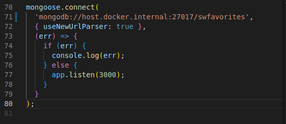

#### Create docker image

#### Create docker container

#### Make container to host (mongodb) request 

#### Container to container communication 
#### Create mongodb container 

#### Set mongodb container IPAddress to node application

#### Running app.js container 

#### Container to container communication

#### Creating Container Network

#### Update app.js  mongoose connectiom with new mongodb container name (mongodb)

#### Build docker image 

#### Run docker container using this image

## M5_Build_Multi_Container_Applications_with_docker

#### Creating docker container for mongodb

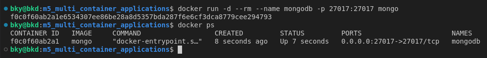

#### Creating docker container for backend

- Backend Dockerfile

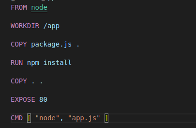

- Backend docker image

- Backend Docker Container

- Update mongodb connection in app.js from "localhost" to "host.docker.internal" and rebuild the docker image

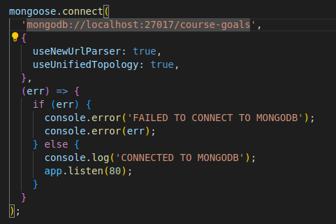

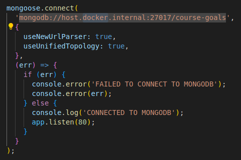

- Rebuild backend docker image

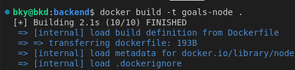

- Build backend docker container

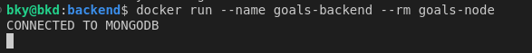

- Expose the port to communicate to frontend run on local host

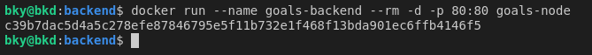

#### Creating docker container for frontend

- Frontend Dockerfile

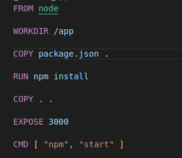

- Frontend docker image

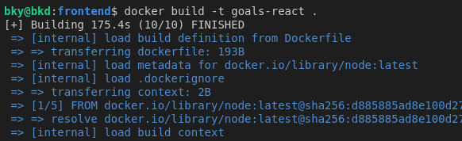

- Build frontend docker container 

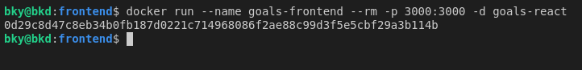

- Testing web app

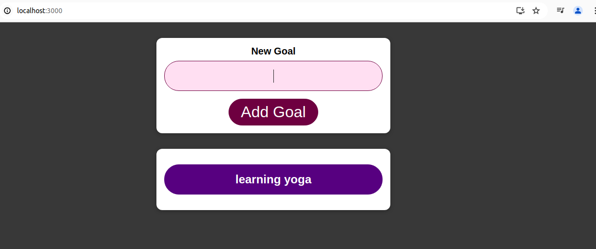

#### Adding Docker Network (Cross Container Communication)

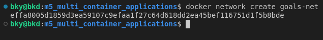

- Create mongodb docker container within a network

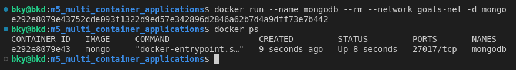

- Backend Docker Container with a network

- Update mongodb connection in app.js from "host.docker.internal" to container name of the database within the network and rebuild the docker image

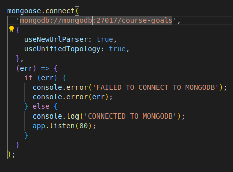

- rebuild backend docker image

- Build backend docker container within a network

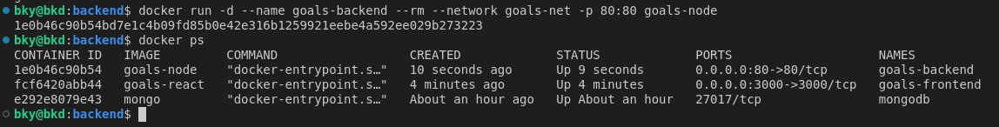

#### Creating docker container for frontend No need of network

- Frontend Dockerfile

- Frontend docker image

- Build frontend docker container 

- Testing web app

### Adding Data Persistence to Mongodb with volumes and limited access

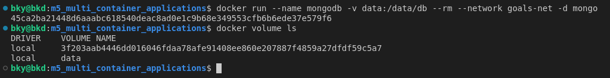

#### Mongodb Limit Access

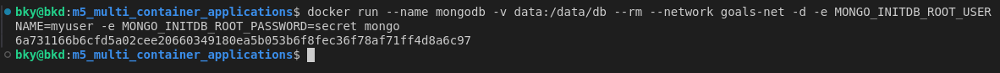

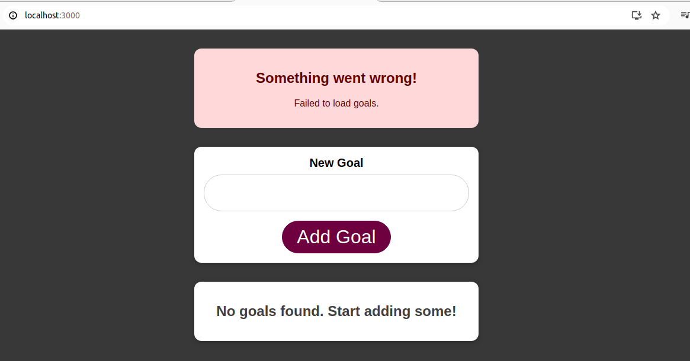

- To fix this error update mongodb connection in the app.js

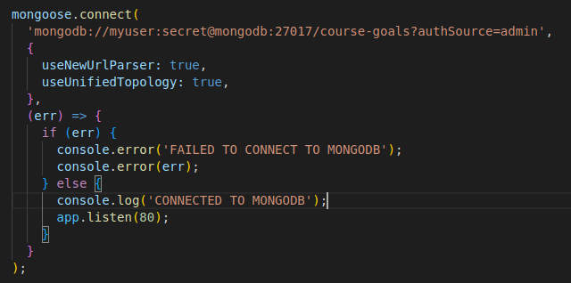

#### Backend Volumes and Bind Mounts  

    1. Bind Mount volume to update local host script
    -v $(pwd):/app
    2. Named volume for logs file persist data at the Nodejs container
    -v logs:/app/logs 
    3. Anonymous volume to protect missing dependencies for node module
    -v /app/node_modules
    4. Add File sharing path for docker desktop 
    5. Delete package-lock.json
    6. Add "devDependencies" with "nodemon" package in package.json file
    7. Add ("start": "nodemon app.js") script to the script section in package.json
    8. In the docker file update [ "node", "app.js" ] to [ "npm", "start" ]
    9. Rebuild docker image

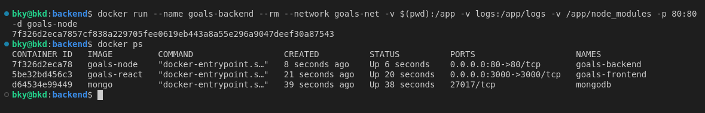

#### Verifying by updating app.js script

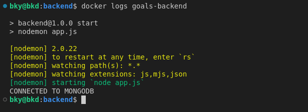
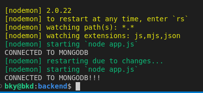

#### Create environment variables for credentials

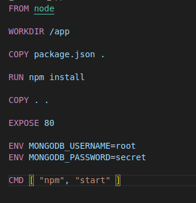

- Running the backend using only username

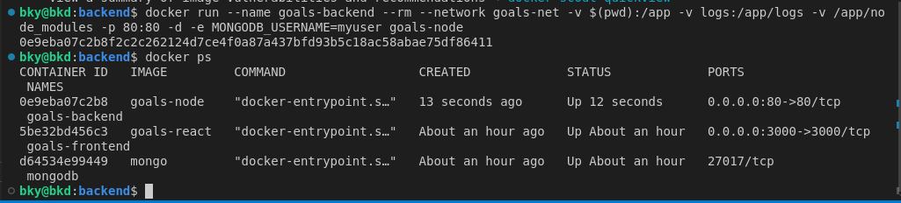

#### Live Source Code Update for React Container

    1. Bind Mount volume to update local host script
    -v $(pwd)/scr:/app/scr
    2. Add File sharing path for docker desktop

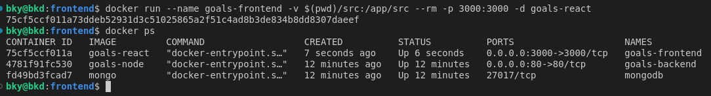

- Modifying frontend source code web page updates immediately

## Docker-Compose

### Installing Docker Compose on Linux

    1. sudo curl -L "https://github.com/docker/compose/releases/download/1.27.4/docker-compose-$(uname -s)-$(uname -m)" -o /usr/local/bin/docker-compose
    2. sudo chmod +x /usr/local/bin/docker-compose
    3. sudo ln -s /usr/local/bin/docker-compose /usr/bin/docker-compose
    4. docker-compose --version

#### To start all docker-compose services

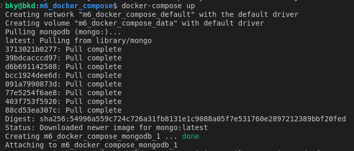

#### To stop docker-compose 

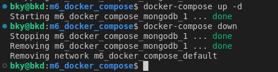

#### Configure docker-compose file

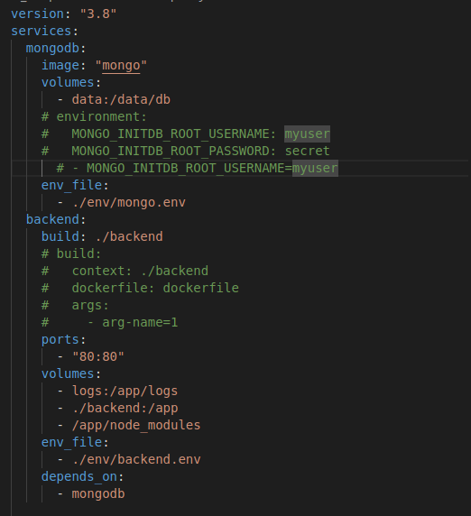

#### Configuring frontend container on docker-compose file

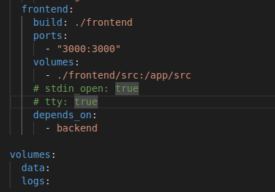

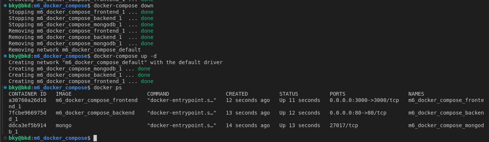

## M9_Deploying_Docker_Container

1. Create and launch EC2 instance, VPC and security group
2. Configure security group to expose all required ports to WWW
3. Connect to instance (SSH), install Docker and run container.docker

### Deploy to AWS EC2 (via SSH)

1. Create and EC2 instance

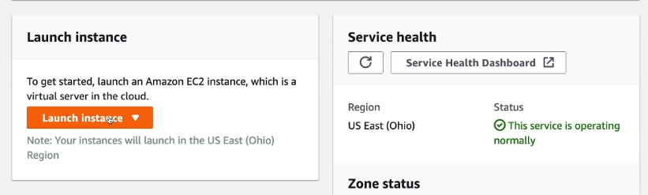

2. Choose an Amazone Machine Image(AMI)

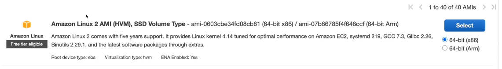

3. choose an instance type (Free tier)

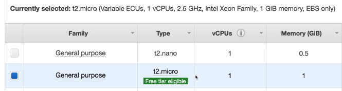

4. Configure Instance Details and set a vpc

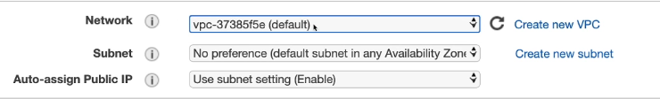

5. click review and launch

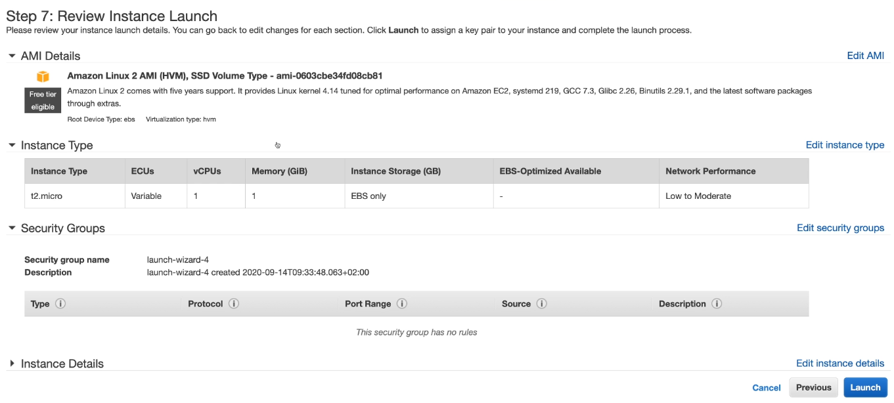

6. click launch

7. select an existing key pair or Create a new key pair and download it

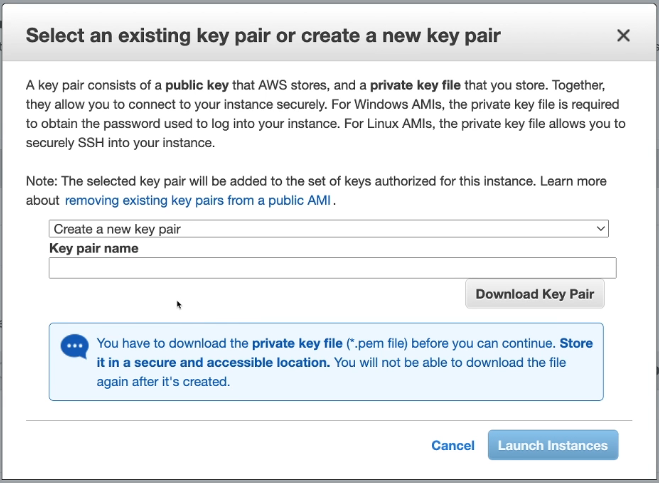

8. click launch

9. Verify instance is up and running

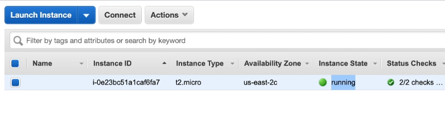

10. Click connect and choose a Standalone ssh client

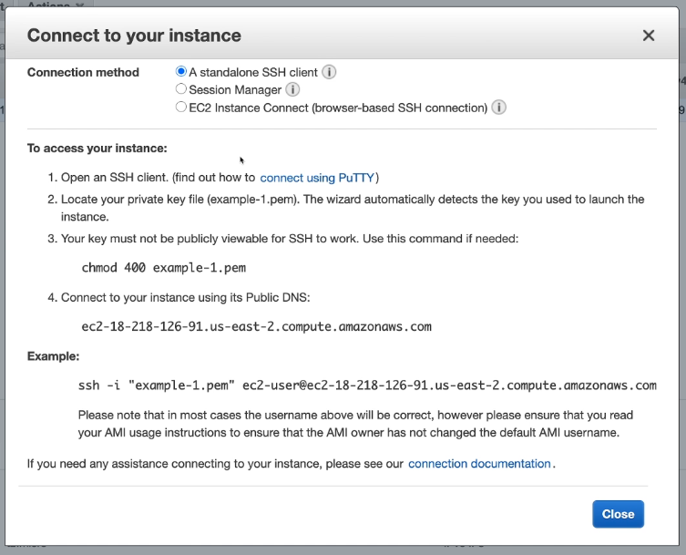

11. To access the instance follow the given steps

#### Install Docker on a virtual EC2 instance

    sudo yum update -y
    sudo yum -y install docker
 
    sudo service docker start
 
    sudo usermod -a -G docker ec2-user

    # Make sure to log out + back in after running these commands. Once you logged back in, run this command:

    sudo systemctl enable docker

    # check whether Docker is available by running:

    docker version

#### Pushing our local image to cloud

1. log in to docker hub and create a repository

        <docker-hub/repository-name>

2. Create Docker image locally 

        docker build -t <image-name> .
    
3. Push to docker-hub by renaming the image

        docker tag <image-name> <docker-hub/repository-name>

        docker login

        docker push <docker-hub/repository-name>

4. Run and Publish the App on EC2 via SSH
    
        sudo docker run -d --rm -p 80:80 <docker-hub/repository-name>
        sudo ps

5. Copy the address of the app on the AWS console (IPv4 Public IP) and test on the browser if the page is running

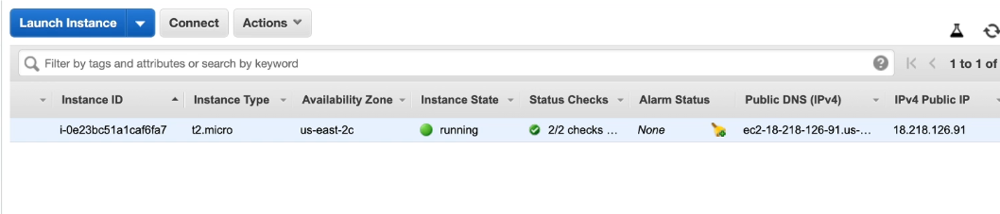

6. Configure the security group (Inbound rules)

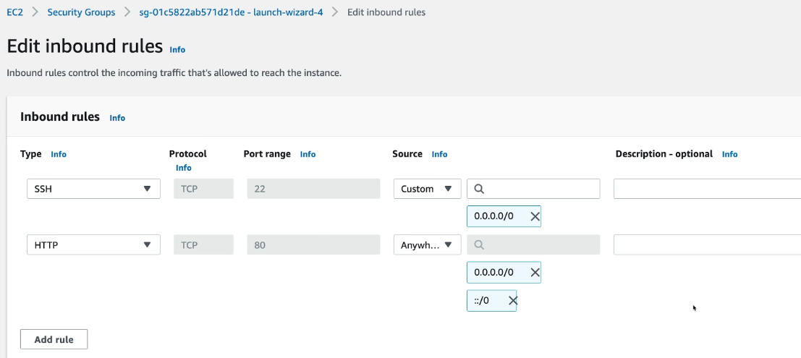

## M2_Kubernetes_Setup_and_Installation

### [Install kubectl binary with curl on Linux](https://kubernetes.io/docs/tasks/tools/install-kubectl-linux/)

    # Download the latest release with the command:
    curl -LO "https://dl.k8s.io/release/$(curl -L -s https://dl.k8s.io/release/stable.txt)/bin/linux/amd64/kubectl"

    # Validate the binary
    curl -LO "https://dl.k8s.io/release/$(curl -L -s https://dl.k8s.io/release/stable.txt)/bin/linux/amd64/kubectl.sha256"

    # Validate the kubectl binary against the checksum file:
    echo "$(cat kubectl.sha256)  kubectl" | sha256sum --check

    # Install kubectl
    sudo install -o root -g root -m 0755 kubectl /usr/local/bin/kubectl
    # Test to ensure the version you installed is up-to-date:
    # Or use this for detailed view of version:
    kubectl version --client --output=yaml

### [minikube start](https://minikube.sigs.k8s.io/docs/start/?arch=%2Flinux%2Fx86-64%2Fstable%2Fbinary+download)

    # To install the latest minikube stable release on x86-64 Linux using binary download:

    curl -LO https://storage.googleapis.com/minikube/releases/latest/minikube-linux-amd64

    sudo install minikube-linux-amd64 /usr/local/bin/minikube && rm minikube-linux-amd64

    # Start your cluster:
    minikube start

    # Interact with your cluster:
    kubectl get po -A

    #minikube can download the appropriate version of kubectl and you should be able to use it like this:

    minikube kubectl -- get po -A

    You can also make your life easier by adding the following to your shell config: 

    alias kubectl="minikube kubectl --"

    # additional insight into your cluster state, minikube bundles the Kubernetes Dashboard:

    minikube dashboard
    # To terminate:
    ctrl command + C 

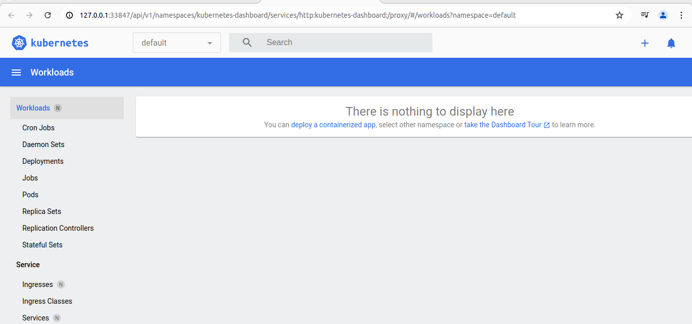

#### Deployment using imperative approach

- checking if cluster is up and running

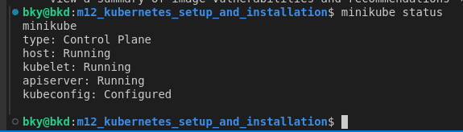

- if cluster not running then run the command:

        minikube start --driver=docker

- Sending instruction to the master node/ control plane to create a new deployment object:

        kubectl create deployment <deployment-name> --image=<image-name>

        kubectl get deployment

        kubectl get pods

        kubectl deployment delete first-app

- create a repository in docker hub

        docker tag <image-name> <dockerhub/repository-name>

        docker push <dockerhub/repository-name>

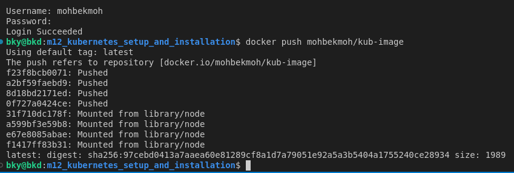

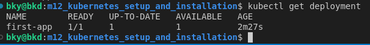

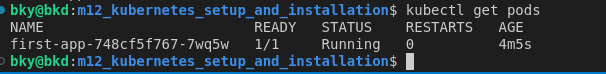

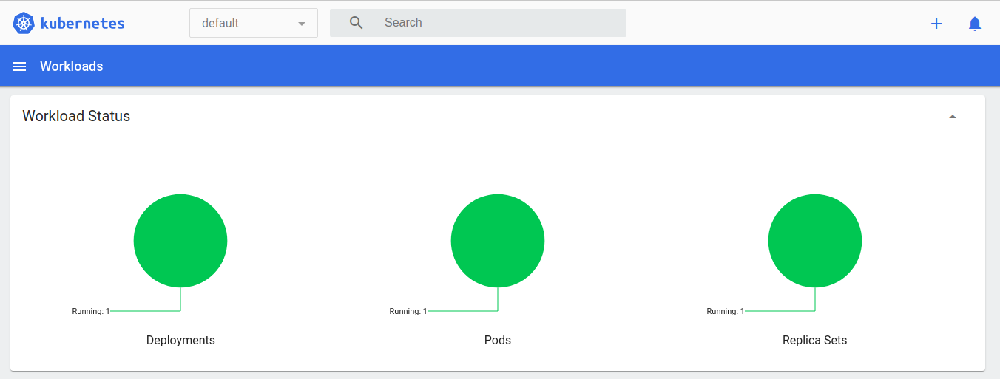

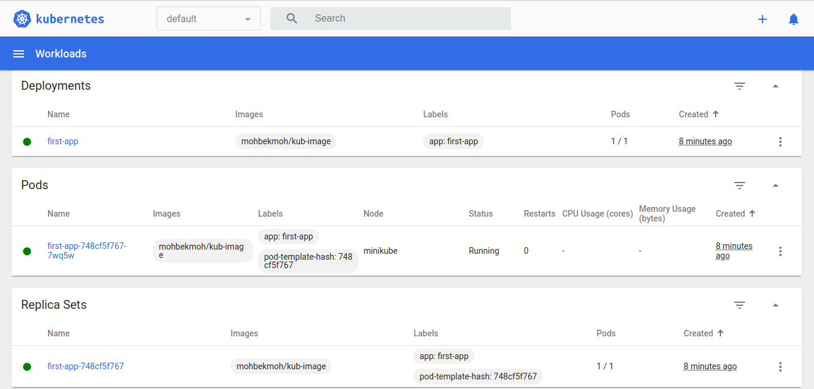

